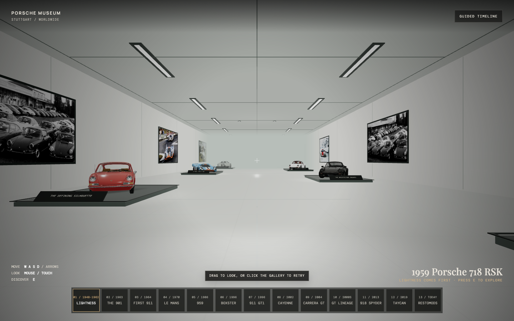

# Porsche 3D Museum

**A walk through Porsche’s past, present, and enduring ideas.**

Explore thirteen exhibits in a quiet, contemporary gallery—from lightweight sports racers and the first 911s to Le Mans legends, electric performance, and reimagined classics.

[**Enter the museum →**](https://jonfairbanks.github.io/porsche-3d-museum/)

## Take your time

Walk around the cars, look closely at their details, and discover the ideas behind each era. Archival photography and short museum essays place the collection in context. Follow the **Guided timeline**, or explore at your own pace.

The collection includes the 718 RSK, early 911, 930 Turbo, 917K, 959, Boxster Spyder, 911 GT1, Cayenne, Carrera GT, 911 GT2, 918 Spyder, Taycan Turbo GT, and a RAUH-Welt 911.

## Plan your visit

Best experienced on a laptop or desktop in Chrome. Allow the collection to finish preparing before entering.

| To… | Use… |
| --- | --- |
| Walk | **W A S D** or the **arrow keys** |
| Look around | Click the gallery and move your **mouse** |
| Explore a nearby exhibit | **E** |
| Close an exhibit or release mouse look | **Escape** |
| Jump to an era | The **chapter rail** or **Guided timeline** |

Touch dragging is also available for looking around.

---

An independent digital museum study, made for the pleasure of looking closely. Not affiliated with or endorsed by Porsche. Vehicle-model credits appear in each exhibit; archival image sources are listed in the [media credits](assets/media/MANIFEST.md).
